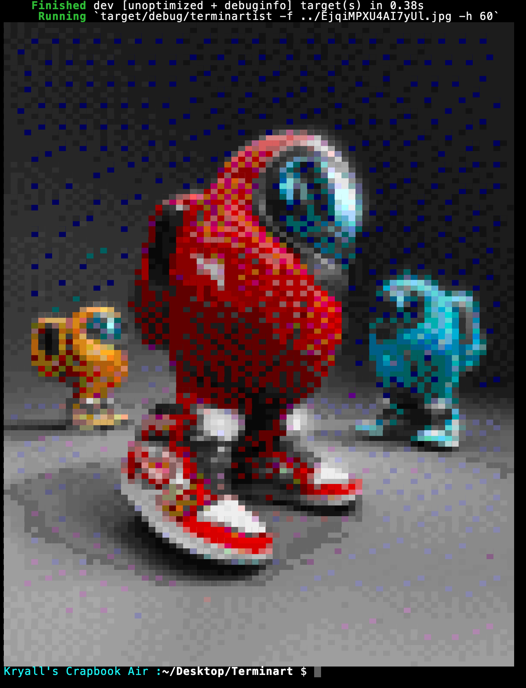

# Terminart

A program that displays images within the command-prompt, written in Rust.
<sup> Made by Kryal|</sup>


This program takes in a file, and spits out a mess of blocks and ANSI codes that represents the given image as closely as possible.

## Example:

 


---
<br>

## How to install this thing:
** You will need Cargo installed to run this, as is usual for things written in Rust.

1. Clone git repository and cd into the project directory:
    ```sh
    git clone https://github.com/Da-Real-KryallTerminart;
    cd ./Terminart
    ```

2. Use cargo to compile the program: (it shouldn't give you an image just yet)
    ```sh
    cargo run --release
    ```

* The binary will be ready for use now, you can move it wherever you please; it is found in:
    ```fs
    ./target/release/terminartist
    ```

## How to use this thing:
You use command-line arguments in conjunction with the compiled binary to output images; as follows: <br>

```sh
# Say you want to convert a file at ~/Desktop/thing.png to an image, the command would be this:

# (assuming the binary is in the same folder)

$ ./terminartist -f ~/Desktop/thing.png
[output]

# say you want to set the height in lines of the output image to 32; the command will then be the following:
$ ./terminartist -f ~/Desktop/thing.png -h 32
[output]

# that's pretty much it.
```

* The `-f` flag specifies the file path. (And is required.)
* The `-h` flag gives the output height, preserving the size ratio of the image (optional, default is half the screen height)

## Other notes:
* This is compatible with both Mac and Linux, and likely Windows (untested) operating systems.
* This thing makes use of the Floyd–Steinberg dithering algorithm as well as ANSI 256 colour sequences to be specific.
* This project will be subject to more refinement; I still think it is possible to again double the quality of the image result by subdivision.